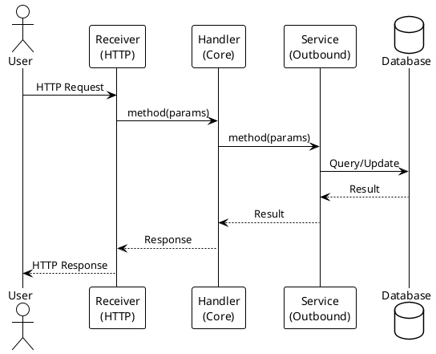

# File templates and extraction sources

Structure to reproduce for each file, and what to read in the code to fill it in.

## architecture-flow.md

Sections: an "Original vs. Indirect Flows" remark (only primary, externally-triggered flows are shown - Kafka delivery receivers are completions of those, documented as part of the same tree, not separately), a "Kafka Cycles" explainer, then one subsection per HTTP receiver, one sub-subsection per endpoint, each showing an ASCII call tree:

```
Receiver.method()
└─ API.method()
   └─ Handler.method()
      ├─ SPI.method()
      │  └─ Service
      │     └─ Database/External
      └─ Another SPI
         └─ Another Service
```

Extract from: `@Path`/`@GET`/`@POST` annotations and `@Inject` fields on each `*Receiver.java` (in a `feature.<name>` or `cross` package); the Handler each injected API resolves to; the SPIs each Handler injects; audit-log event strings (`auditLog.log("...")` calls) - reproduce them verbatim, they're part of the documented flow.

## architecture-flow-kafka-reference.md

Sections: maintenance notes (which files to re-read when updating), "Data Persistence" (one entry per outbound-postgres/outbound-mongodb service), "External System Integrations" (one entry per outbound-httpclient/webservice/kafka service), "Kafka Topic Cycles" (one block per topic: producer, consumer, trigger, exact `mp.messaging.*` config lines), and a "Summary of All Endpoints" table (columns: Receiver | Route | Method | Flow Type | Kafka Topic Connection | Data Sinks) covering every endpoint including indirect Kafka-triggered ones.

Extract from: `app-server/src/main/resources/application.properties` (`mp.messaging.*` lines are the source of truth for topic names and channel wiring - never invent a topic name); each `*Receiver.java`'s `@Incoming` topic; each outbound `*Service.java`'s emitter/client target.

## architecture-module-participants.md

Sections: a "Quick Reference" table (one row per Maven module, participant class names), then one section per module with Purpose, Package (the actual `feature.<name>` / `cross(.<concern>)` / `external.*` path - grep the real source, never assume), a class list grouped by role, Responsibilities, Technology, then closing "Summary by Layer", "Participant Count by Module", and "Maintenance Guide" sections.

Extract from: `find <module>/src/main/java -name "*.java"` per module, reading each file's package declaration and top-level Javadoc/class comment; `pom.xml` per module for the Maven artifact list.

## docs/flows/*.puml

One file per unique flow (query flows, order flows per commodity/technology, purchase flows, event-driven Kafka-inbound flows). PlantUML sequence diagram syntax:



Show: actors, Receivers, Handlers, Services, databases, Kafka topics (for order flows), audit logging where it happens, and where an asynchronous path takes over. Add a matching entry to `docs/flows/README.md` (file name, trigger, technology path, participants, databases, key patterns).
