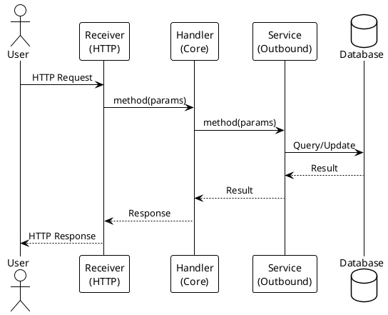

# How to Recreate Architecture Documentation

**Purpose**: Complete instructions for regenerating all architecture documentation files from the actual codebase. Use this guide when the system changes significantly (new modules, new suppliers, major refactoring, etc.).

**Time Estimate**: 2-3 hours for full regeneration  
**Complexity**: Medium (requires code reading + structured documentation writing)

---

## Overview: What Gets Recreated

This process regenerates FOUR documentation files from scratch, using the actual codebase as the source of truth:

1. **architecture-flow.md** - Human-readable flow descriptions (HTTP requests → handlers → persistence/integrations)
2. **architecture-flow-kafka-reference.md** - Technical reference (Kafka topic mappings, configurations, external integrations)
3. **architecture-module-participants.md** - Module-to-class inventory with summary table
4. **flows/\*.puml** - PlantUML sequence diagrams (one per unique flow)

**Plus**: flows/README.md providing index and common patterns

---

## Step 1: Understand Current System State

### 1.1 Scan Maven Module Structure

```bash
# List all Maven modules
find . -name pom.xml -type f | grep -v target | sort

# Expected structure:
# ./pom.xml (root)
# ./app-server/pom.xml (runner)
# ./inbound-http/pom.xml
# ./inbound-kafka/pom.xml
# ./core/pom.xml
# ./outbound-postgres/pom.xml
# ./outbound-mongodb/pom.xml
# ./outbound-httpclient/pom.xml
# ./outbound-webservice/pom.xml
# ./outbound-kafka/pom.xml
# ./external-outbound-rest/pom.xml
# ./external-outbound-soap/pom.xml
# ./external-outbound-kafka/pom.xml
# ./external-inbound-kafka/pom.xml
```

### 1.2 Verify Key Source Files Exist

```bash
# Inbound adapters (entry points)
find . -path "**/adapter/inbound/*Receiver.java" -type f | wc -l

# Core business logic
find . -path "**/core/application/*Handler.java" -type f | wc -l

# Inbound ports (APIs)
find . -path "**/core/api/*API.java" -type f | wc -l

# Outbound ports (SPIs)
find . -path "**/core/spi/*SPI.java" -type f | wc -l

# Outbound adapters (services)
find . -path "**/adapter/outbound/*Service.java" -type f | wc -l
```

### 1.3 Check Configuration

```bash
# Read Kafka topic configuration
cat app-server/src/main/resources/application.properties | grep "mp.messaging"

# Should show:
# - Incoming channels for Kafka receivers (mp.messaging.incoming.*)
# - Outgoing channels for Kafka producers (mp.messaging.outgoing.*)
# - Topic names for each channel
```

---

## Step 2: Extract Architecture Data from Code

### 2.1 List All Receiver Classes (HTTP & Kafka Inbound)

Read each receiver file to understand:
- HTTP endpoint paths (@Path annotations)
- Which APIs/SPIs it calls
- What it returns (HTML, JSON, void)

**HTTP Receivers** (inbound-http module):
```bash
find inbound-http/src/main/java -name "*Receiver.java" -exec grep -l "@Path" {} \;
```

For each receiver:
- Extract @Path value
- Extract @Inject fields (these are the APIs it calls)
- Extract @GET/@POST methods and their signatures
- Note what database/services it connects to

**Kafka Receivers** (inbound-kafka module):
```bash
find inbound-kafka/src/main/java -name "*Receiver.java" -exec cat {} \;
```

For each receiver:
- Extract @Incoming topic name
- Extract @Inject fields (which API it calls)
- Note the message type it consumes

### 2.2 List All Handler Classes (Core Business Logic)

Read each handler in `core/src/main/java/com/example/hexademo/core/application/`:
```bash
ls core/src/main/java/com/example/hexademo/core/application/
```

For each handler:
- Which API interface does it implement?
- Which SPIs does it inject (@Inject)?
- What does each method do?
- Does it log to audit? Does it call suppliers?

### 2.3 List All API Interfaces (Inbound Ports)

Read `core/src/main/java/com/example/hexademo/core/api/`:
```bash
ls core/src/main/java/com/example/hexademo/core/api/
```

For each API:
- What methods does it define?
- What are the parameters and return type?
- Which handler implements it?

### 2.4 List All SPI Interfaces (Outbound Ports)

Read `core/src/main/java/com/example/hexademo/core/spi/` (or `core/src/main/java/com/example/hexademo/core/port/out/`):
```bash
ls core/src/main/java/com/example/hexademo/core/spi/
# or
ls core/src/main/java/com/example/hexademo/core/port/out/
```

For each SPI:
- What methods does it define?
- Which service implements it?
- Which handlers use it?

### 2.5 List All Outbound Services

For each module (outbound-postgres, outbound-mongodb, outbound-httpclient, outbound-webservice, outbound-kafka):
```bash
find outbound-*/src/main/java -name "*Service.java" -type f | xargs grep "implements"
```

For each service:
- Which SPI does it implement?
- What database/external system does it connect to?
- What are the key methods?

### 2.6 List All External Stubs

For each module (external-outbound-*):
```bash
find external-outbound-*/src/main/java -name "*Stub.java" -type f
```

For each stub:
- Which receiver does it feed?
- Which Kafka topics does it read from / write to?
- How is it triggered?

---

## Step 3: Create architecture-flow.md

**File Location**: `docs/architecture-flow.md`

### 3.1 Structure

```markdown
# Architecture Flow Analysis

## Important: Original vs. Indirect Flows
[Remark explaining that only primary flows are shown]

## Key Insight: Kafka Cycles
[Explanation of the Kafka integration pattern]

## HTTP Inbound Flows

### [ReceiverName] ([path]) - [Technology Stack]

#### GET [path] - [Flow Name]
[Tree diagram showing the flow]

#### POST [path] - [Flow Name]
[Tree diagram showing the flow, including Kafka if applicable]

## Note: Kafka Delivery Receivers
[Brief note explaining these are completions of order flows]

## Summary
[Cross-reference to kafka-reference.md and flow diagrams]
```

### 3.2 For Each Endpoint

Show complete flow:
1. HTTP request comes in
2. Receiver parses it
3. Calls API handler
4. Handler may call multiple SPIs
5. SPIs call services
6. Services call databases/external systems
7. For orders: show the Kafka delivery cycle too

Use ASCII tree format like:
```
Receiver.method()
└─ API.method()
   └─ Handler.method()
      ├─ SPI.method()
      │  └─ Service
      │     └─ Database/External
      └─ Another SPI
         └─ Another Service
```

### 3.3 Technology Stack Notation

In each section header, include the technology path:
```
POST /admin/order-fruits - HTML Form → REST Client → Kafka Delivery Topic
POST /admin/order-beverages - HTML Form → SOAP Client → Kafka Delivery Topic
POST /admin/order-nonfood - HTML Form → Kafka Order Topic → Kafka Delivery Topic
```

---

## Step 4: Create architecture-flow-kafka-reference.md

**File Location**: `docs/architecture-flow-kafka-reference.md`

### 4.1 Structure

```markdown
# Architecture Flow - Kafka Integration Reference

## Maintenance Notes
[Instructions for updating these files]

## Data Persistence
[PostgreSQL and MongoDB details]

## External System Integrations
[REST, SOAP, Kafka outbound adapters]

## Kafka Topic Cycles
[For each topic: producer, consumer, trigger, configuration]

## Summary of All Endpoints
[Complete table including indirect Kafka flows]
```

### 4.2 Kafka Topic Sections

For each Kafka topic, document:
- Topic name
- Producer (which service/stub produces to it)
- Consumer (which receiver consumes from it)
- Trigger (what HTTP request initiates the cycle)
- Configuration lines from application.properties
- Data flow description

Example:
```
**Topic: fruit-deliveries**
- **Producer**: FruitSupplierStub (in external-outbound-rest)
- **Consumer**: FruitDeliveryReceiver (in inbound-kafka)
- **Trigger**: Admin POST /admin/order-fruits → FruitSupplierService → REST call → Stub publishes delivery
- **Config**: 
  - Outgoing: `mp.messaging.outgoing.fruit-deliveries-out.topic=fruit-deliveries`
  - Incoming: `mp.messaging.incoming.fruit-deliveries.topic=fruit-deliveries`
```

### 4.3 Complete Endpoint Table

Include ALL endpoints (primary + indirect):
- HTTP GET endpoints
- HTTP POST order endpoints
- HTTP POST purchase endpoints
- Kafka inbound receivers (marked as indirect/event flows)

Columns: Receiver | Route | Method | Flow Type | Kafka Topic Connection | Data Sinks

---

## Step 5: Create architecture-module-participants.md

**File Location**: `docs/architecture-module-participants.md`

### 5.1 Structure

```markdown
# System Participants by Maven Module

## Quick Reference: All Modules & Participants
[Summary table with module name and all participants]

## [Module Name]
**Purpose**: [One-line purpose]
**Package**: [Full package path]

### [Subpackage or Category]
- `ClassName` - [Brief description]
- `ClassName` - [Brief description]

**Responsibilities**:
- [Bullet list of what this module does]

**Technology**: [Tech stack used]
```

### 5.2 For Each Module

1. List all classes/participants that belong to it
2. Group logically (e.g., handlers, services, stubs)
3. Add brief description of each class
4. Add module-level responsibilities
5. Add technology stack details
6. Add configuration details if relevant

### 5.3 Add Summary Tables

At the end:
- Participant count by module
- Summary by architectural layer

---

## Step 6: Create Sequence Diagrams (flows/\*.puml)

**File Location**: `docs/flows/*.puml`

### 6.1 Create One Diagram Per Unique Flow

Create diagrams for:

**Query Flows** (simple reads):
- `admin-get-dashboard.puml` - GET /admin → ProductsHandler → InventoryService → PostgreSQL
- `admin-get-audit.puml` - GET /admin/audit-fragment → AuditLogHandler → AuditLogService → MongoDB
- `shop-get-catalog.puml` - GET /shop → ProductsHandler → InventoryService → PostgreSQL
- `api-get-products.puml` - GET /api/products → ProductsHandler → InventoryService → PostgreSQL

**Order Flows (REST)** - for each product category (fruits, vegetables, dairy):
- `admin-order-[category].puml` - shows full cycle with Kafka delivery
- `api-order-[category].puml` - same but via JSON API

**Order Flows (SOAP)** - for each product category (beverages, meat, bakery):
- `admin-order-[category].puml` - shows full cycle with Kafka delivery
- `api-order-[category].puml` - same but via JSON API

**Order Flows (Kafka)** - for non-food products:
- `admin-order-nonfood.puml` - shows two-topic cycle
- `api-order-nonfood.puml` - same but via JSON API

**Purchase Flows**:
- `shop-checkout.puml` - POST /shop/checkout → PurchaseHandler → InventoryService + AuditLogService
- `api-purchase.puml` - POST /api/products/purchase → PurchaseHandler → InventoryService + AuditLogService

**Event-Driven Flows** (Kafka inbound):
- `cashpoint-purchase-event.puml` - Kafka event → CashpointReceiver → PurchaseHandler → Inventory

### 6.2 Sequence Diagram Format

Use PlantUML sequence diagram syntax:



### 6.3 Key Elements to Show

- Actors (User, Admin, API Client, External System)
- Receivers (HTTP entry points)
- Handlers (Core business logic)
- Services (Outbound adapters)
- Databases (PostgreSQL, MongoDB)
- Kafka topics (for order flows)
- Audit logging (where applicable)
- Asynchronous paths (note when Kafka takes over)

### 6.4 Create flows/README.md

Document all diagrams with:
- File name
- Trigger (HTTP endpoint or Kafka topic)
- Technology path
- Participants involved
- Databases accessed
- Key patterns used

---

## Step 7: Validation Checklist

### 7.1 Completeness

- [ ] All HTTP receivers documented in architecture-flow.md
- [ ] All GET endpoints documented
- [ ] All POST endpoints documented
- [ ] All Kafka delivery cycles shown (order → stub → Kafka → receiver)
- [ ] All handlers referenced
- [ ] All APIs referenced
- [ ] All SPIs referenced
- [ ] All outbound services referenced
- [ ] All external stubs referenced
- [ ] All Kafka topics documented with producer/consumer pairs
- [ ] architecture.properties Kafka configuration matched

### 7.2 Consistency

- [ ] Class names match actual code exactly
- [ ] Package paths match actual code structure
- [ ] Technology stacks are accurate (REST, SOAP, Kafka)
- [ ] Kafka topic names match application.properties
- [ ] Module names match pom.xml directories
- [ ] Flow descriptions match actual code execution paths

### 7.3 Cross-Reference Validation

- [ ] All participants in architecture-module-participants.md appear in code
- [ ] All Kafka topics in flows match application.properties
- [ ] All Kafka topics in architecture-flow.md cycles match architecture-flow-kafka-reference.md
- [ ] All endpoints in architecture-flow.md have corresponding sequence diagrams in flows/

### 7.4 Diagram Validation

```bash
# Validate all PUML files
for file in docs/flows/*.puml; do
  echo "Validating $file..."
  plantuml -checkonly "$file" || echo "ERROR in $file"
done
```

---

## Step 8: Update Memory System

After regenerating, update the persistent memory:

1. Update `[[memory]]/architecture-flow-maintenance.md` with any changes to the process
2. Update `[[memory]]/MEMORY.md` index if new entries were added
3. Save notes about what changed from previous version

---

## Quick Regeneration for Small Changes

If only **one** file needs updating (e.g., one endpoint changed):

1. **Small HTTP change** → Update only the relevant section in `architecture-flow.md`
2. **Small Kafka change** → Update the topic section in `architecture-flow-kafka-reference.md`
3. **Small class change** → Update the relevant module in `architecture-module-participants.md`
4. **Small endpoint change** → Update relevant flow diagram in `docs/flows/`

**Do NOT recreate entire files** for small changes. Use surgical edits.

---

## Tools Required

- `plantuml` CLI (for validating PUML syntax)
- Text editor or IDE
- Git (for staging changes)

Install if needed:
```bash
# macOS
brew install plantuml

# Ubuntu/Debian
sudo apt-get install plantuml

# Or use online: plantuml.com
```

Validate syntax:
```bash
plantuml -checkonly docs/flows/example.puml
```

---

## Common Pitfalls to Avoid

1. **Don't recreate from diagrams** - Extract from code, not from existing diagrams
2. **Don't ignore Kafka topics** - All order endpoints have async delivery paths
3. **Don't forget audit logging** - Every flow logs to MongoDB
4. **Don't miss external stubs** - They complete the Kafka cycles
5. **Don't hardcode package paths** - Always verify against actual code
6. **Don't skip validation** - Test PUML files with plantuml -checkonly
7. **Don't forget application.properties** - Kafka config is the source of truth for topics

---

## Time-Saving Tips

1. Use grep to find all classes of a type quickly
2. Copy the previous version as a template and update incrementally
3. Run validation early and often (don't wait until the end)
4. Group changes by module (regenerate one module at a time)
5. Test individual PUML files as you create them
6. Keep a checklist of all files that need updating

---

## When to Regenerate vs. Incremental Update

### Regenerate completely if:
- New Maven modules added
- New suppliers added (Fruits, Vegetables, etc.)
- Major refactoring of handler/service structure
- Package structure changed significantly
- Kafka topic strategy changed

### Incremental update if:
- One endpoint changed
- One class renamed
- One Kafka topic renamed
- Minor logic change in one handler
- Test data changed

---

## Debugging Tips

**Flows don't match code?**
- Check actual receiver methods in source file
- Verify @Inject fields are all documented
- Check for new API/SPI interfaces

**Kafka topics missing?**
- Read application.properties for all `mp.messaging` entries
- Verify both incoming and outgoing channels are documented
- Check for topics in producer tests

**PUML validation errors?**
- Check participant names have no spaces
- Verify all open braces have closes
- Check for special characters in messages
- Use aliases for long names

**Architecture not making sense?**
- Trace one flow from HTTP request through to database
- Verify each step has corresponding class in code
- Check that all intermediate calls are documented
- Confirm Kafka is only used for async delivery, not inline

---

## Questions to Answer Before Regenerating

1. Have any new product categories/suppliers been added?
2. Have any Kafka topics been renamed?
3. Have any Maven modules been reorganized?
4. Have any HTTP endpoints been added/removed?
5. Has the core business logic structure changed?
6. Are there new external integrations (REST, SOAP, Kafka)?

If yes to any, then full regeneration is needed. Otherwise, target updates.
